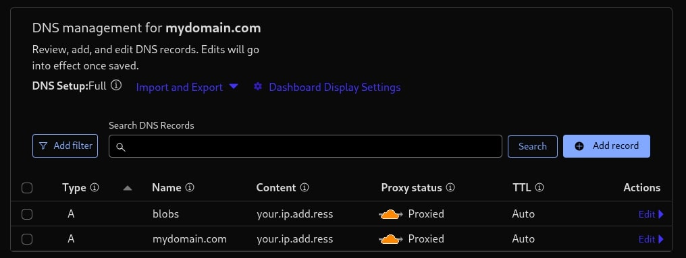

# 🚀 Bare-Metal Server Deployment Guide (Ubuntu 22.04)

This guide explains how to deploy your application stack on a **dedicated VM**.
The server will intercept **all traffic** for your domain.

---

## 🔑 0. Connect via SSH

You need an **SSH key** and a user with **sudo privileges**.

```bash
ssh -i '/path/to/sshkeyfile' <user>@<server_ip>
```

---

## 🛠️ 1. Prepare the VM

### 1.1 Update System & Install Docker

```bash
# Update packages
sudo apt-get update

# Install Docker
sudo apt-get install -y docker.io

# Enable & start Docker
sudo systemctl enable --now docker

# (Optional) Run Docker without sudo
sudo usermod -aG docker $USER
# Log out & back in for this to take effect
```

---

### 1.2 Install k3s (Lightweight Kubernetes)

```bash
curl -sfL https://get.k3s.io | sh -
```

✅ k3s will run automatically as a system service.

---

### 1.3 Install Helm (Kubernetes Package Manager)

```bash
# Add Helm GPG key
curl https://baltocdn.com/helm/signing.asc | gpg --dearmor \
  | sudo tee /usr/share/keyrings/helm.gpg > /dev/null

sudo apt-get install -y apt-transport-https

# Add Helm repository
echo "deb [arch=$(dpkg --print-architecture) signed-by=/usr/share/keyrings/helm.gpg] \
https://baltocdn.com/helm/stable/debian/ all main" \
| sudo tee /etc/apt/sources.list.d/helm-stable-debian.list

# Install Helm
sudo apt-get update
sudo apt-get install -y helm
```

---

### 1.4 Configure kubectl Access

```bash
mkdir -p ~/.kube
sudo k3s kubectl config view --raw > ~/.kube/config
sudo chmod 600 ~/.kube/config
```

✅ Test your cluster:

```bash
kubectl get nodes
```

You should see **one node** (your machine).

---

## 🎬 2. Initial Manual Deployment

### 2.0 Prerequisites

You need:

* ✅ A **valid email** (for Let’s Encrypt SSL)
* ✅ The **server IP address**
* ✅ A working **domain name** of A type
* ✅ On that domain, a corrisponding DNS rule of A type, connecting the domain to the machine IP.
* ✅ On the same domain, another DNS record of A type colled **blobs** of A type


⚠️ Initially,

   1. set the proxy status of the records to DNS only (not proxied)
   2. set your domain’s SSL policy to **Flexible** (not Full).

---

### 2.1 Configure Environment Variables

On your **local repo copy**:\
 Go to `config` folder

1. **REST Server**

   * Copy `secrets-blueprint.yaml` → `secrets.yaml`
   * Update values inside.
   * *(Optional)* Edit DB name in `rest-server-config.yaml`.

2. **Ingress Config**

   * Copy `config-blueprint.env` → `config.env`
   * Update variables inside.

---

### 2.2 Upload Deployment Files

From your **local machine repo folder**:

```bash
scp -i '/path/to/sshkeyfile' -r deploy <user>@<server_ip>:~/
```

---

### 2.3 Run Deployment Script

SSH into the server and run:

```bash
cd ~/deploy
chmod +x deploy.sh
./deploy.sh
```

✅ Check deployment status:

```bash
kubectl get all
kubectl get pods -A -w
```

---

### 2.4 Update Domain SSL

After successful deployment:

* Set SSL policy to **Full (Strict)**.

---

## 🔒 Firewall Configuration

For security, allow only:

* **22/tcp** → SSH
* **443/tcp** → HTTPS

Example (UFW):

```bash
sudo ufw allow 22
sudo ufw allow 443
sudo ufw enable
```

---

## 🧹 Cleaning Up

If something breaks, run:

```bash
cd ~/deploy
chmod +x clear.sh   # first time only
./clear.sh
```

---

✨ Done! Your application stack should now be up and running securely on your VM.
